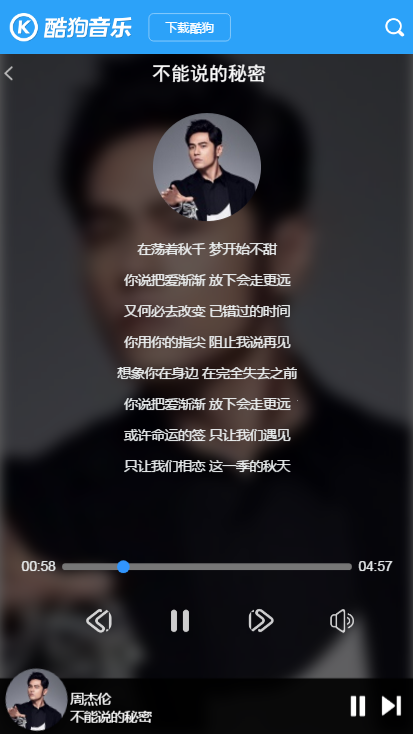
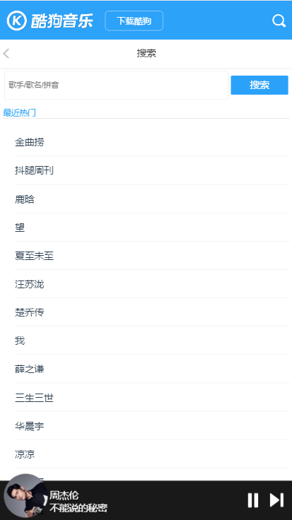
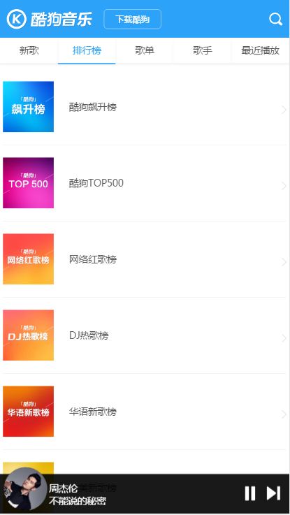

# vue-kugou-demo
仿kugou的vue-demo
# 前言
这是本人在从0跳坑学习vue以来一直摸索来的仿kugou项目，里面的接口采用了网上demo的接口，
可能写的还有很多瑕疵，以后我会不定时完善的，也欢迎提供意见。
# 技术采用
vue2+vuex+vue-router+webpack+es6+vue-resource+jQuery+vue-awesome-swiper
# 项目运行
cd musicplay  
npm i        
npm run dev           
访问 http://localhost:8080/#/  
# 最后说明
这个项目希望可以帮助很多从0开始学习vue的人帮助，如果你觉得还不错，希望给个"STAR"，
谢谢~~
# 项目预览

